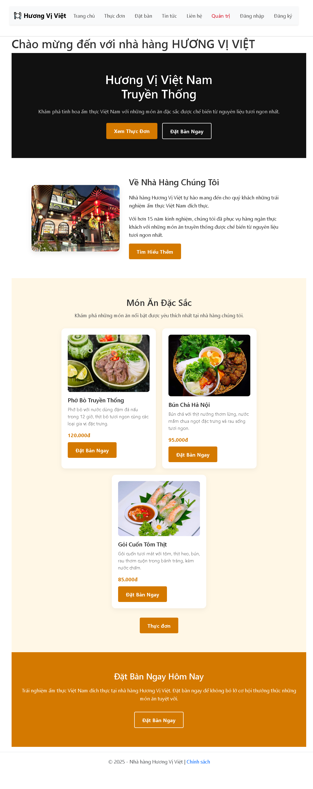

# WebsiteGioiThieuNhaHangTest
Website giới thiệu nhà hàng HƯƠNG VỊ VIỆT
1. Tất cả dữ liệu chương trình đều đặt trong thư mục GioiThieuNhaHang
2. website có các trang mục như sau:
   - Trang chủ - giới thiệu về nhà hàng
   - Thực đơn: trang trình bày các món ăn (Menu)
   - Đặt bàn: khách hàng khi truy cập vào website giới thiệu, có thể đặt bàn trực tuyến tại đây!
   - Tin tức: trang hiển thị các thông tin về nhà hàng và các khuyến mãi của nhà hàng.
   - Liên hệ: trang tiếp nhận các hỏi đáp, thắc mắc, lời nhắn mà người truy cập website muốn gửi về cho nhà hàng.
   - ...
3. giao diện nổi bật của website Giới thiệu nhà hàng HƯƠNG VỊ VIỆT

  

 

  

  

  

